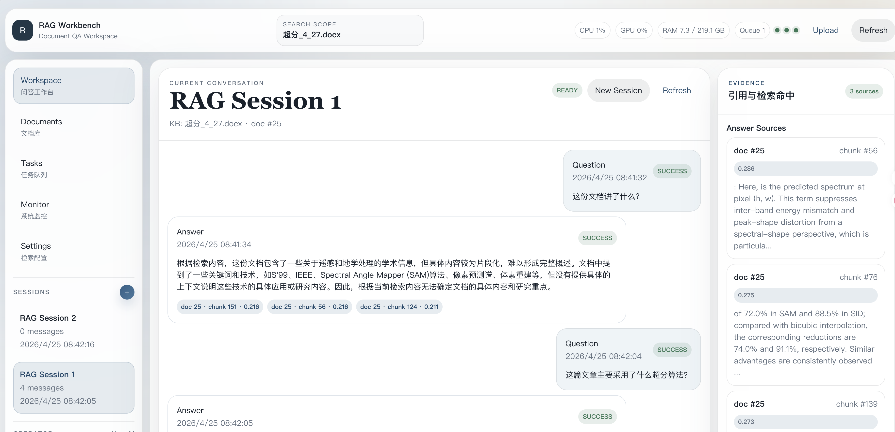
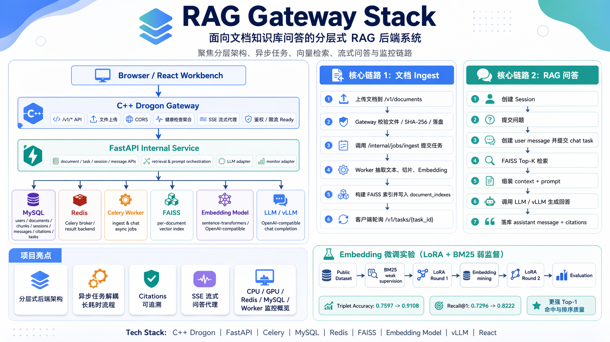

# RAG Gateway Stack

面向文档知识库问答的工程化 RAG 后端项目。它不是单页问答 demo，而是一套把外部 API 网关、内部业务服务、异步任务、数据库、向量索引、LLM 调用和监控工作台拆开的可扩展系统骨架。

项目当前由 `C++ Drogon Gateway`、`FastAPI Internal Service`、`Celery Worker`、`MySQL`、`Redis`、`FAISS`、`Embedding Model`、`OpenAI-compatible LLM / vLLM` 和 `React Workbench` 组成。前端主要用于调试、演示和观测，核心能力集中在后端 RAG 链路。



## 项目定位

这个项目适合用来验证和展示一套真实 RAG 应用后端应该具备的基础能力：

- 文档上传、去重、解析、切片、向量化和索引构建。
- 基于 FAISS 的 Top-K 检索、可选 rerank、Prompt 组装和 LLM 回答。
- 会话、消息、任务状态、引用来源和索引元数据的持久化。
- C++ 网关统一承载外部 API、上传控制、CORS、健康检查聚合和 SSE 代理。
- Celery 异步化处理 ingest 和 chat，避免长耗时流程阻塞请求。
- React 工作台展示文档、任务、问答、引用和系统监控。

## 项目亮点

| 能力 | 说明 |
| --- | --- |
| 分层架构 | 浏览器只访问 C++ Gateway，内部业务逻辑收敛在 FastAPI 服务中，便于后续接入鉴权、限流和审计。 |
| 异步任务 | 文档解析、embedding、FAISS 构建和问答任务交给 Celery Worker 执行，任务进度可查询。 |
| 可追溯回答 | 每条 assistant 消息都会保存 citations，前端可展示引用片段、chunk、score 和来源文档。 |
| 模型切换保护 | `document_indexes.embedding_model` 记录索引所用 embedding 模型，避免模型切换后误用旧向量空间。 |
| 监控视图 | 提供 CPU、内存、磁盘、GPU、MySQL、Redis、Worker、队列和 RAG 数据概览。 |
| 实验留档 | 包含 embedding LoRA 微调、RAG ingest/retrieval 容量和性能验证文档，方便继续迭代。 |

## 架构概览



```text
Browser / React Workbench
        |
        v
C++ Drogon Gateway
        |-- public API
        |-- upload validation
        |-- CORS
        |-- health aggregation
        |-- SSE proxy
        |
        v
FastAPI Internal Service
        |-- document / task / session / message APIs
        |-- retrieval and prompt orchestration
        |-- LLM and monitor adapters
        |
        +--> MySQL        : users, documents, chunks, indexes, sessions, messages, citations, tasks
        +--> Redis        : Celery broker / result backend
        +--> Celery       : ingest and chat async jobs
        +--> FAISS        : per-document vector index
        +--> Embedding    : sentence-transformers or OpenAI-compatible provider
        +--> LLM / vLLM   : OpenAI-compatible chat completion endpoint
```

## 技术栈

| 层级 | 技术 |
| --- | --- |
| 外部网关 | C++17, Drogon, CURL, JsonCpp |
| 内部服务 | Python, FastAPI, Pydantic |
| 异步任务 | Celery, Redis |
| 数据存储 | MySQL |
| 向量检索 | FAISS, sentence-transformers, reranker |
| 大模型调用 | OpenAI-compatible API, vLLM |
| 前端工作台 | Vite, React, TypeScript |
| 运维脚本 | Bash, curl, benchmark scripts |

## 核心链路

### 文档 Ingest

1. 客户端上传文档到 `POST /v1/documents`。
2. C++ Gateway 校验文件类型、计算 SHA-256、保存文件，并写入文档记录。
3. Gateway 调用 FastAPI 内部接口提交 ingest 任务。
4. Celery Worker 抽取文本、切片、生成 embedding、构建 FAISS 索引。
5. Worker 写入 `doc_chunks`、`document_indexes`，并更新任务和文档状态。
6. 客户端通过 `GET /v1/tasks/{task_id}` 查看处理进度。

### RAG 问答

1. 客户端创建 session 并提交用户问题。
2. Gateway 创建 user message，再提交 chat task。
3. Worker 基于 FAISS 检索候选片段，并按配置执行 rerank。
4. 系统组装上下文和 Prompt，调用 OpenAI-compatible LLM。
5. assistant message 与 citations 落库。
6. 前端刷新消息列表，展示回答和引用来源。

## 目录结构

```text
Repo/
├── cpp_gateway/          # Drogon C++ 对外网关
├── python_rag/           # FastAPI + Celery + RAG 业务实现
├── db/                   # MySQL 初始化脚本与增量升级脚本
├── frontend/             # Vite + React + TypeScript 前端工作台
├── scripts/              # 数据库、API、worker、vLLM、E2E 启动脚本
├── docs/                 # 设计、实验、容量和性能说明
├── data/                 # 上传文件与索引数据目录
├── .env.example          # 后端环境变量示例
└── README.md
```

## 快速开始

### 1. 初始化环境变量

```bash
cp .env.example .env
```

常用配置项包括 MySQL、Redis、Celery、存储目录、embedding、rerank 和 LLM 地址。默认 LLM 走 OpenAI-compatible 接口，可指向本地 vLLM：

```bash
LLM_ENABLE=true
LLM_PROVIDER=openai_compatible
LLM_BASE_URL=http://127.0.0.1:9000/v1
LLM_MODEL=local-llm

EMBEDDING_PROVIDER=sentence_transformers
EMBEDDING_MODEL=sentence-transformers/paraphrase-multilingual-MiniLM-L12-v2

CHAT_TOP_K=5
CHAT_CANDIDATE_TOP_K=30
CHAT_ENABLE_MOCK_FALLBACK=true
```

注意：`cpp_gateway/config.json` 目前仍独立配置 MySQL、Redis 和监听端口。根目录 `.env` 会被 `cpp_gateway/scripts/start_gateway.sh` 读取，但 Drogon 的数据库连接仍以 `cpp_gateway/config.json` 为准。

### 2. 安装 Python 依赖

```bash
python3 -m venv .venv
source .venv/bin/activate
pip install -r python_rag/requirements.txt
```

### 3. 初始化数据库

```bash
bash scripts/init_db.sh
```

脚本会读取根目录 `.env`，创建 `MYSQL_DATABASE`，执行 `db/init.sql`，再按文件名字典序执行 `db/*_schema_upgrade.sql`。

如果业务用户不存在，或没有建库权限，可以在 `.env` 中补充：

```bash
MYSQL_ADMIN_USER=root
MYSQL_ADMIN_PASSWORD=your_root_password
```

### 4. 编译 C++ Gateway

需要本机已安装 `cmake`、C++17 编译器、Drogon、CURL、JsonCpp 以及 MySQL / Redis 相关 Drogon 依赖。

```bash
cmake -S cpp_gateway \
      -B cpp_gateway/build \
      -DCMAKE_BUILD_TYPE=Debug

cmake --build cpp_gateway/build -j
```

如果使用 vcpkg，可额外传入：

```bash
-DCMAKE_TOOLCHAIN_FILE=/path/to/vcpkg/scripts/buildsystems/vcpkg.cmake
```

### 5. 一键启动后端链路

MySQL / Redis 启动后，可以用脚本统一拉起 FastAPI、Celery Worker 和 C++ Gateway：

```bash
bash scripts/start_all.sh
bash scripts/start_all.sh status
```

常用开关：

```bash
# 启动前先初始化数据库
START_INIT_DB=true bash scripts/start_all.sh

# 同时启动前端 Vite dev server
START_FRONTEND=true bash scripts/start_all.sh

# 停止后台服务
bash scripts/start_all.sh stop
```

如果 `cpp_gateway/build/cpp_gateway` 不存在，脚本会尝试用 CMake 编译 Gateway；本机仍需要 Drogon、CURL、JsonCpp 以及 MySQL / Redis 相关 Drogon 依赖。使用 vcpkg 时可以通过 `CMAKE_TOOLCHAIN_FILE` / `Drogon_DIR` 环境变量传给脚本。

### 5b. 手动启动后端链路

建议每个服务单独开一个终端：

```bash
# 1. MySQL / Redis 先启动，并初始化数据库
bash scripts/init_db.sh

# 2. 可选：启动 vLLM
source .venv/bin/activate
bash scripts/start_vllm.sh

# 3. 启动 FastAPI
source .venv/bin/activate
bash scripts/start_api.sh

# 4. 启动 Celery Worker
source .venv/bin/activate
bash scripts/start_worker.sh

# 5. 启动 C++ Gateway
bash cpp_gateway/scripts/start_gateway.sh
```

健康检查：

```bash
curl http://127.0.0.1:8000/internal/health
curl http://127.0.0.1:8000/internal/monitor/overview
curl http://127.0.0.1:8080/health
curl http://127.0.0.1:8080/v1/monitor/overview
```

### 6. 启动前端工作台

```bash
cd frontend
npm install
npm run dev
```

Vite 默认把 `/health` 和 `/v1` 代理到 `http://127.0.0.1:8080`。如需修改代理目标，可以创建 `frontend/.env`：

```bash
VITE_PROXY_TARGET=http://127.0.0.1:8080
```

构建前端：

```bash
cd frontend
npm run build
```

## E2E 验证

完整链路一键验证：

```bash
bash scripts/e2e_all.sh ./day7_demo.md
```

该脚本会创建用户、上传文档、等待 ingest、创建会话、提交 chat、拉取消息，并触发一次带 relevance label 的检索评估，用来验证 Recall@K / MRR / NDCG 指标链路。

先创建用户：

```bash
curl -X POST http://127.0.0.1:8080/v1/users \
  -H "Content-Type: application/json" \
  -d '{"name":"demo-user"}'
```

上传与索引：

```bash
bash scripts/e2e_ingest.sh ./day7_demo.md
```

完整问答：

```bash
bash scripts/e2e_chat.sh ./day7_demo.md
```

如果切换 embedding 模型，历史文档需要重新 ingest，否则 FAISS 索引维度或向量空间可能不一致。

## 前端页面

| 页面 | 说明 |
| --- | --- |
| `Workspace` | 核心问答工作区，包含会话、消息、上传、RAG 开关和引用面板。 |
| `Documents` | 文档上传、索引状态、chunk/向量化摘要和文档详情。 |
| `Tasks` | ingest/chat 任务表、进度、meta_json 和错误日志。 |
| `Monitor` | CPU、GPU、内存、MySQL、Redis、Worker、队列、RAG、ingest、FAISS 和检索质量摘要。 |
| `Settings` | 网关地址、用户、top_k、chunk 参数和模型显示名。 |

## API 概览

前端和外部客户端优先通过 C++ Gateway 访问：

| Method | Path | 说明 |
| --- | --- | --- |
| `GET` | `/health` | 网关聚合健康检查。 |
| `POST` | `/v1/users` | 创建用户。 |
| `GET` | `/v1/users/latest` | 最近用户列表。 |
| `POST` | `/v1/documents` | 上传文档并提交 ingest 任务。 |
| `GET` | `/v1/documents/{doc_id}` | 查询文档详情。 |
| `POST` | `/v1/sessions` | 创建会话。 |
| `POST` | `/v1/sessions/{session_id}/messages` | 创建用户消息并提交 chat 任务。 |
| `GET` | `/v1/sessions/{session_id}/messages` | 获取消息和 citations。 |
| `GET` | `/v1/tasks` | 查询任务列表。 |
| `GET` | `/v1/tasks/{task_id}` | 查询单个任务状态。 |
| `POST` | `/v1/chat/stream` | SSE 流式回答代理。 |
| `GET` | `/v1/monitor/overview` | 系统与 RAG 监控概览。 |

FastAPI 内部接口以 `/internal/*` 为前缀，不建议浏览器直接访问。

## 延伸文档

- [Embedding 微调实验](docs/embedding_finetune.md)：记录 KALM embedding 的 LoRA triplet 微调流程、指标和结论。
- [RAG ingest/retrieval 容量说明](docs/rag_ingest_retrieval_capacity.md)：整理 ingest、检索和资源容量相关设计。
- [性能测试指南](docs/performance_test_guide.md)：提供部署后的性能验证、压测流程和留档模板。
- [Gateway 鉴权与限流](docs/gateway_auth_rate_limit.md)：说明 Drogon Gateway 的 API Key 鉴权和 Redis 限流配置。
- [监控指标说明](docs/monitoring_metrics.md)：说明解析耗时、FAISS 耗时、TTFT、Celery 并发和检索质量指标。

## 当前限制

- Gateway 的 MySQL / Redis 连接还没有完全收敛到根目录 `.env`，目前仍依赖 `cpp_gateway/config.json`。
- `Monitor` 的历史趋势目前是前端近端采样，聚合窗口依赖 `request_metrics` 最近样本。
- GPU 监控依赖 `nvidia-smi`，非 NVIDIA 环境会返回空数组。
- 当前索引是单文档单 FAISS 索引，后续可扩展为多文档知识库、分片索引或向量数据库。
- SSE 流式接口形态完整，但生成侧仍以先得到完整答案再分块输出为主，后续可升级为真实 token streaming。
- PDF 仅支持可提取文本的电子文档，扫描件 OCR 尚未接入。
- Gateway 已支持 API Key 鉴权和 Redis 请求限流；租户隔离和审计日志尚未接入。

## 后续方向

- 提供 Docker Compose，一键启动 MySQL、Redis、FastAPI、Celery Worker 和 C++ Gateway。
- 扩展自动化测试覆盖更多失败路径、鉴权限流边界和检索评估数据集。
- Gateway 增加 request id 透传、审计日志和更完整的统一错误响应。
- LLM 调用升级为真实 token streaming，并记录首 token 延迟和总耗时。
- 从单文档索引扩展到知识库级多文档检索。
- 将 embedding LoRA 接入方式标准化，支持合并模型路径或 adapter 加载。

## 推荐验证命令

```bash
python3 -m compileall python_rag
cd frontend && npm run build
bash -n scripts/init_db.sh scripts/start_api.sh scripts/start_worker.sh scripts/start_vllm.sh cpp_gateway/scripts/start_gateway.sh
```

当前机器如果没有 Drogon 开发包，需要先安装 Drogon 或设置 `Drogon_DIR` / `CMAKE_PREFIX_PATH` 后再编译 `cpp_gateway`。
