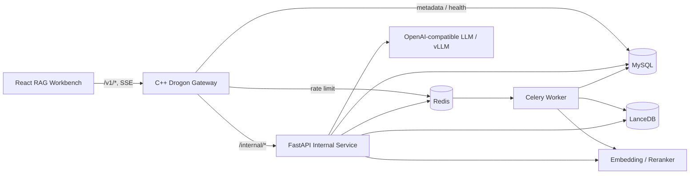
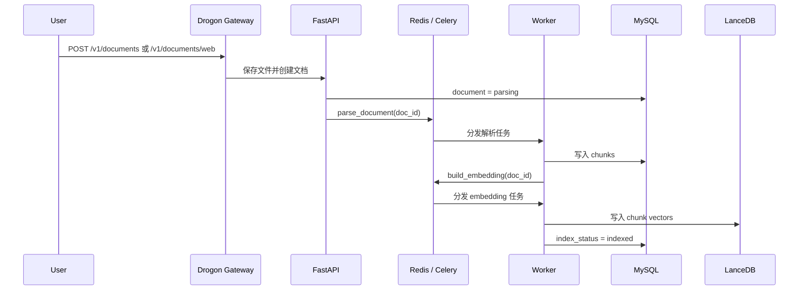
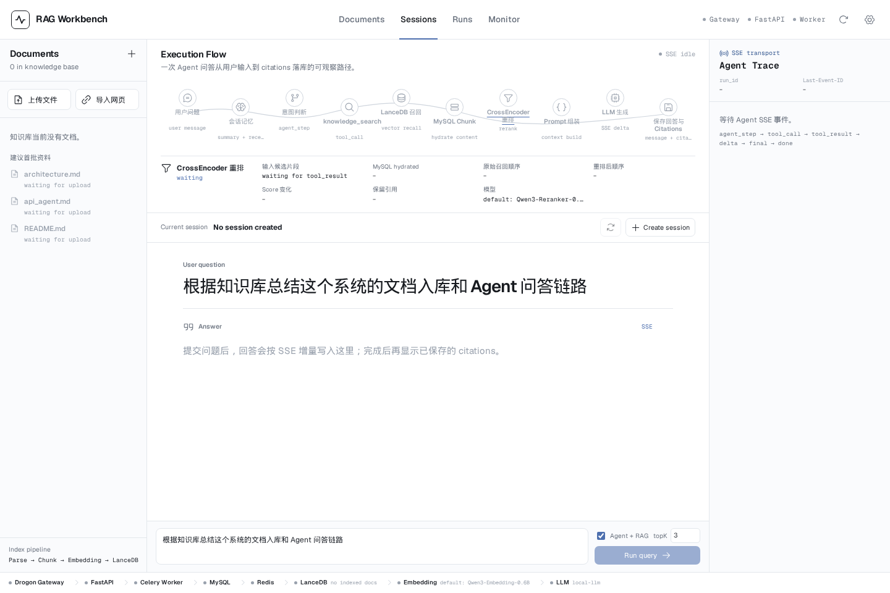

# 把一次 RAG 问答摊开来看：RAG Gateway Stack 的架构与实现

RAG 系统最容易被低估的地方，是它看起来只需要“检索几段文本，再调用一次模型”。真正开始做工程实现后，问题会迅速变成另一种形态：文件由谁接收，chunk 以谁为准，向量索引如何重建，流式回答断线后是否重复生成，Agent 调过哪些工具，最终引用能不能回查。

这个仓库不是一个套着聊天框的模型调用示例，而是一套可以在本地完整运行、观察和验证的 RAG / Agent 工程栈。它把入口网关、业务服务、异步任务、结构化数据、向量检索、模型调用和前端工作台拆成独立边界，让一条问题从进入系统到答案与 citations 落库的过程可以被检查。

本文按技术博客的方式介绍它：先讨论为什么这样拆，再沿着文档入库、普通 RAG、Agent、SSE 续传和前端观测逐层展开，最后给出可以直接运行的启动与验证方法。

## 一张图先看清边界


```mermaid
flowchart LR
    Browser[React RAG Workbench]
    Gateway[C++ Drogon Gateway]
    API[FastAPI Internal Service]
    Worker[Celery Worker]
    MySQL[(MySQL)]
    Redis[(Redis)]
    Lance[(LanceDB)]
    Embed[Embedding / Reranker]
    LLM[OpenAI-compatible LLM / vLLM]

    Browser -->|/v1/*, SSE| Gateway
    Gateway -->|/internal/*| API
    Gateway -->|metadata / health| MySQL
    Gateway -->|rate limit| Redis
    API --> MySQL
    API --> Redis
    Redis --> Worker
    Worker --> MySQL
    Worker --> Lance
    Worker --> Embed
    API --> Lance
    API --> Embed
    API --> LLM
```

| 组件 | 主要职责 | 默认入口 |
| --- | --- | --- |
| React Workbench | 文档、会话、执行流程、回答、引用与 Agent Trace | `http://127.0.0.1:5173` |
| C++ Drogon Gateway | 对外 API、上传、CORS、鉴权、限流、健康聚合、SSE 代理 | `http://127.0.0.1:8080` |
| FastAPI | 文档、检索、Prompt、Chat、Agent、Trace 与监控业务 | `http://127.0.0.1:8000` |
| Celery Worker | 解析、切片、embedding、索引和非流式 Chat 任务 | Redis broker |
| MySQL | 文档、chunk、会话、消息、citations、任务与 Agent Trace | `.env` |
| Redis | Celery broker / result backend，也可用于 Gateway 限流 | `.env` |
| LanceDB | chunk 向量与召回元数据 | `data/lancedb` |
| Embedding / Reranker | Qwen embedding 与 CrossEncoder 重排 | API / Worker 进程内 |
| LLM / vLLM | OpenAI-compatible Chat Completion | `.env` |

这里有一个刻意的设计：浏览器只面对 Gateway，FastAPI 保留为内部业务入口。Gateway 负责协议和流量边界，Python 负责变化更快的 RAG 与 Agent 逻辑。这样既没有把业务规则塞进 C++，也没有让上传、鉴权、限流和 SSE 代理散落在每个 Python 路由里。

## 数据该由谁说了算

RAG 项目经常同时拥有数据库、缓存和向量库。三者都能“存数据”，但不能同时成为事实来源。

本项目把 MySQL 作为结构化数据的 source of truth：文档是否存在、chunk 正文是什么、消息是否成功、引用来自哪里、Agent 运行了几步，都以 MySQL 记录为准。LanceDB 保存的是可重建的检索索引；Redis 保存的是任务传递和短期运行状态。

这条边界带来几个直接结果：

- LanceDB 召回的是候选 `chunk_id`，正文仍从 MySQL 批量读取。
- 删除或重建文档时，先依据 MySQL 文档状态决定业务行为，再同步向量索引。
- embedding 模型变化后必须重建旧索引，不能把不同向量空间混在一起比较。
- citations 保存文档与 chunk 标识，而不是只保留一段无法回查的文本。

## 第一条流水线：文档如何进入知识库

文档入口支持本地文件和网页 URL。两种来源在创建文档记录后汇入同一条异步 ingest 流程。


```mermaid
sequenceDiagram
    participant U as User
    participant G as Drogon Gateway
    participant A as FastAPI
    participant Q as Redis / Celery
    participant W as Worker
    participant M as MySQL
    participant L as LanceDB

    U->>G: POST /v1/documents 或 /v1/documents/web
    G->>A: 保存文件并创建文档
    A->>M: document = parsing
    A->>Q: parse_document(doc_id)
    Q->>W: 分发解析任务
    W->>M: 写入 chunks
    W->>Q: build_embedding(doc_id)
    Q->>W: 分发 embedding 任务
    W->>L: 写入 chunk vectors
    W->>M: index_status = indexed
```

解析和 embedding 是两个任务，而不是一个不可分割的黑盒。任务元数据会记录 `queued`、`document_loaded`、`document_chunked`、`chunks_written`、`embedding_started`、`embedding_finished` 等阶段，前端据此展示 Parsing、Chunking、Embedding、Indexed 或 Failed。

当前文件入口支持 `.md`、`.txt`、`.json`、`.csv`、`.pdf`、`.docx` 和 `.xlsx`。网页入口负责抓取正文并保存为普通文档，后续不再维护一套特殊的网页检索逻辑。

## 第二条流水线：普通 RAG 如何形成可引用答案

普通 RAG 是稳定基线。它没有 Agent 工具循环，但完整保留了检索、重排、持久化和流式传输。

```text
用户问题
  -> 创建 user message
  -> 在 indexed 文档范围内生成 query embedding
  -> LanceDB 召回候选 chunk_id
  -> MySQL 批量补齐 chunk 正文与文档信息
  -> CrossEncoder rerank
  -> 组装带来源信息的 Prompt
  -> LLM 流式生成
  -> 保存 assistant message 与 citations
  -> 发出 done
```

请求没有传 `doc_id` / `doc_ids` 时，检索范围是当前可用的 indexed 文档；显式传入后则限制到指定文档。召回和重排分开保留 `lancedb_score`、`rerank_score`、原始 rank 与最终 rank，因此“为什么某个 chunk 成为引用”可以被解释，而不只是得到一个最终列表。

FastAPI 业务接口和多数 Gateway JSON 路径使用同一种响应外壳：

```json
{
  "code": 0,
  "message": "ok",
  "data": {}
}
```

业务错误保持相同结构，只改变 `code`、`message`、`data` 和对应 HTTP 状态。Gateway 自身的参数校验、鉴权、限流与健康检查也遵守这一 envelope；SSE 则继续使用带 `type` 的事件协议。

## 第三条流水线：Agent 在 RAG 之上增加了什么

Agent 不是把普通问答换成一个更长的 Prompt。它增加的是决策、工具协议、会话记忆和可持久化的执行轨迹。

```text
用户问题
  -> 注入用户记忆、会话摘要与最近消息
  -> 意图路由
  -> LLM 决策或强制 knowledge_search
  -> 执行只读工具
  -> 将工具观察写回上下文
  -> 继续推理或生成最终回答
  -> 保存 answer、citations、run、steps、tool calls
```

当前工具保持只读和小范围：

| 工具 | 用途 |
| --- | --- |
| `knowledge_search` | 检索 indexed 知识库，返回 chunk、score、标题和检索元数据 |
| `get_document_detail` | 查询单个文档状态、元数据和 chunk 摘要 |
| `list_ready_documents` | 列出当前已经可检索的文档 |
| `list_message_citations` | 按 assistant message 查询已保存引用 |

工具返回统一为 `{"ok": bool, "error": string | null, "data": object}`。只有 `ok=true` 的 `data` 会作为证据进入上下文；工具失败会写入 Trace，并允许模型基于已有观察给出带降级说明的回答。

为了避免模型在“项目架构、文档内容、上传、embedding、索引”等明显知识库问题上漏掉检索，入口有一层轻量意图路由。命中时先执行 `knowledge_search`；问候和普通闲聊不会被强制拉进检索流程。这不是一个通用分类器，而是对当前系统行为边界的显式约束。

## 前端不是聊天皮肤，而是一张运行中的系统剖面图

前端工作台放在整条链路中间观察，而不是把聊天框放在最显眼的位置。左侧是文档及索引阶段，中间是从用户问题到 citations 落库的 Execution Flow，右侧是逐条到达的 Agent SSE Trace，底部则是运行依赖基线。



工作台重点回答四个工程问题：

1. 当前文档停在 Parsing、Chunking、Embedding 还是 Indexed？
2. 本次问题经过了哪个节点，`knowledge_search` 是否成功，rerank 是否实际启用？
3. 回答中的 `[1]`、`[2]` 来自哪个文档和 chunk？
4. SSE 是否发生断线，恢复时使用了哪个 Last-Event-ID？

Execution Flow 使用真实事件推进。后端目前在一次 `tool_result` 中聚合返回 LanceDB、MySQL hydration 和 rerank 信息，因此这几个节点会在工具结果到达后一起完成，界面不会编造不存在的逐节点实时耗时。回答本身包含引用编号时，编号直接连接来源；后端没有提供逐句 span 时，则使用明确的“本次检索证据”区域，不伪造句子级映射。

## SSE 断线续传为什么不能只做前端重试

如果浏览器断线后重新发起一次普通请求，最坏的结果不是少几个 token，而是重复创建 user message、重复生成、重复计费，甚至保存两份 assistant message。

本项目的 SSE 事件具有以下约束：

- 每个数据事件都包含 `type`。
- 可续传事件带单调递增的 `id`。
- 流最终以 `done` 或 `error` 结束。
- 最终回答和 citations 必须先持久化，再发送 `done`。
- 客户端使用 `Last-Event-ID` 恢复，服务端只重放之后的事件。
- 客户端断开后，生成线程继续执行；续传状态默认保留 15 分钟。
- 状态过期时明确失败，不能悄悄重启一次生成。

普通 Chat 首次经过 Gateway 时会创建 `user_message_id`，Gateway 再通过 `X-User-Message-ID` 暴露给前端。重连请求移除原始 `content`，改为携带同一个 `user_message_id` 和 Last-Event-ID，从而命中同一条可续传流。Agent 流则使用稳定 `trace_id` 识别同一次运行。

右侧 Agent Trace 保留 `agent_step -> tool_call -> tool_result -> delta -> final -> done` 的顺序，并展示 `run_id`、`step_id`、`tool_name`、`event_id` 与 Last-Event-ID。连续 delta 会合并显示，避免 token 事件淹没真正有诊断价值的步骤。

## 如何在本地启动

### 1. 准备配置与依赖

```bash
cp .env.example .env

conda create -n rag-api python=3.10
conda activate rag-api
pip install -r python_rag/requirements.txt
pip install -r python_rag/requirements-dev.txt

cd frontend
npm install
cd ..
```

MySQL 和 Redis 需要先可用。初始化或升级数据库：

```bash
bash scripts/init_db.sh
```

Gateway 需要 C++17、CMake、Drogon、CURL、JsonCpp 以及 Drogon 的 MySQL / Redis 依赖。统一启动脚本在二进制不存在时会自动执行 CMake；也可以手动构建：

```bash
cmake -S cpp_gateway -B cpp_gateway/build -DCMAKE_BUILD_TYPE=Debug
cmake --build cpp_gateway/build -j
```

### 2. 确认模型入口

默认使用远端 OpenAI-compatible API。下面的命令只检查 `/models`，不会启动本地 vLLM：

```bash
bash scripts/start_vllm.sh
```

使用本地 vLLM 时，在单独终端显式启动：

```bash
LLM_RUNTIME=local_vllm bash scripts/start_vllm.sh
```

### 3. 启动完整工作台

```bash
START_FRONTEND=true bash scripts/start_all.sh start
```

需要首次启动时顺便初始化数据库：

```bash
START_INIT_DB=true START_FRONTEND=true bash scripts/start_all.sh start
```

统一入口支持整栈或单服务操作：

| 命令 | 行为 |
| --- | --- |
| `bash scripts/start_all.sh start` | 启动 API、Worker、Gateway |
| `START_FRONTEND=true bash scripts/start_all.sh start` | 同时启动前端 |
| `bash scripts/start_all.sh restart api` | 只重启 FastAPI |
| `bash scripts/start_all.sh stop gateway` | 只停止 Gateway |
| `bash scripts/start_all.sh status` | 查看 PID 与 HTTP 健康状态 |
| `bash scripts/start_all.sh logs worker` | 查看 Worker 最近日志 |
| `FOLLOW_LOGS=true bash scripts/start_all.sh logs` | 跟随全部服务日志 |
| `bash scripts/start_all.sh e2e ./day7_demo.md` | 执行完整 E2E |

PID 保存在 `.run/`，日志写入 `logs/`。服务使用独立进程组启动，停止时会终止整个进程组，避免只退出启动 shell 而遗留 Uvicorn、Celery 或 Vite 子进程。启动脚本会等待 HTTP 端口响应；`status` 同时区分进程停止、接口不可达和依赖降级。

单独调试某个进程时仍可直接运行：

```bash
bash scripts/start_api.sh
bash scripts/start_worker.sh
bash cpp_gateway/scripts/start_gateway.sh
```

完整脚本说明见 [scripts/README.md](scripts/README.md)。

## 本地模型与 GPU 分工

LLM 与 embedding / rerank 是不同类型的负载：LLM 可以由独立 vLLM 进程提供 OpenAI-compatible 接口；embedding 和 rerank 在 FastAPI / Worker 内加载。

本地 vLLM 示例：

```bash
LLM_RUNTIME=local_vllm
LLM_BASE_URL=http://127.0.0.1:9000/v1
LLM_MODEL=Qwen3-14B
VLLM_MODEL_PATH=/path/to/Qwen3-14B
VLLM_SERVED_MODEL_NAME=Qwen3-14B
VLLM_CUDA_VISIBLE_DEVICES=4,5
VLLM_TENSOR_PARALLEL_SIZE=2
```

默认检索模型：

```bash
EMBEDDING_MODEL=Qwen/Qwen3-Embedding-0.6B
RERANK_MODEL=Qwen/Qwen3-Reranker-0.6B
```

如果希望 Python 侧留在 CPU，或绑定到独立 GPU：

```bash
PYTHON_DISABLE_CUDA=true

# 或分别控制
API_CUDA_VISIBLE_DEVICES=6
WORKER_CUDA_VISIBLE_DEVICES=6
```

不要在业务代码中写死物理 GPU 编号。启动脚本通过 `CUDA_VISIBLE_DEVICES` 暴露设备，进程内部仍从 `cuda:0` 开始使用可见设备。

## 代码如何分层

```text
Repo/
├── cpp_gateway/          # Drogon C++ 对外网关
├── python_rag/           # FastAPI、Celery、RAG、Agent
├── frontend/             # Vite + React + TypeScript 工作台
├── db/                   # MySQL 初始化与升级脚本
├── scripts/              # 启动、smoke 与 E2E
├── docs/                 # API、环境、性能、容量与演示说明
├── data/                 # 上传文件和本地索引
└── tests/                # Python 回归测试
```

`python_rag/app` 的内部边界：

```text
api/v1/routers/   HTTP 参数与内部路由
agent/            Agent runner、intent、tools、memory、trace、streaming
modules/          documents、ingest、retrieval、chat、sessions、messages、tasks
workers/          Celery app 与 worker task
infra/            MySQL、Redis、Storage 与 schema support
core/             config、logger、error 与 exception handlers
shared/           无业务状态的通用传输工具
```

路由只做入口与参数转换；可复用业务逻辑进入 `modules`；Agent 编排放在 `agent`；异步任务入口放在 `workers`；基础设施访问收敛到 `infra`。这个分层不是为了增加抽象层，而是为了让 HTTP、业务规则和执行环境可以分别测试。

## 常用 API 与验证入口

| Method | Path | 说明 |
| --- | --- | --- |
| `POST` | `/v1/documents` | 上传文件并提交 ingest |
| `POST` | `/v1/documents/web` | 从网页创建文档并提交 ingest |
| `GET` | `/v1/documents` | 查询文档和索引状态 |
| `POST` | `/v1/sessions` | 创建会话 |
| `GET` | `/v1/sessions/{id}/messages` | 查询消息与 citations |
| `POST` | `/v1/chat/stream` | 普通 RAG SSE |
| `POST` | `/v1/agent/chat/stream` | Agent SSE 与 Trace 事件 |
| `GET` | `/v1/tasks/{task_id}` | 查询异步任务 |
| `GET` | `/v1/monitor/overview` | 查询运行与 RAG 摘要 |

健康检查：

```bash
curl http://127.0.0.1:8000/internal/health
curl http://127.0.0.1:8080/health
curl http://127.0.0.1:8080/v1/monitor/overview
```

Agent Trace 内部调试入口：

```text
GET /internal/agent/runs/{run_id}
GET /internal/agent/runs/{run_id}/steps
```

代码级验证：

```bash
python -m pytest
python -m compileall python_rag tests
bash scripts/ci_smoke.sh
```

完整链路验证：

```bash
bash scripts/e2e_all.sh ./day7_demo.md
```

## 当前取舍与仍然开放的问题

这套实现面向本地开发、演示和工程验证，而不是把所有生产问题藏在一个 README 后面。当前边界包括：

- Gateway 的 SSE 代理仍按活跃流占用受限数量的 OS thread，高并发场景还需要异步客户端或线程池演进。
- 对外尚无历史 Sessions / Agent Runs 列表接口；前端不会伪造刷新后不存在的历史记录。
- LanceDB 没有独立健康接口；工作台在没有真实证据时显示 unknown / no indexed docs。
- 后端 citations 以消息和 chunk 为粒度；真正逐句的证据连线需要额外返回 answer span。
- 多租户隔离、生产级密钥管理和部署编排不是当前项目重点。

这些限制会明确显示，而不是用虚构百分比或“健康”状态掩盖。对一个可调试的 RAG 系统来说，知道哪里没有证据，和知道哪里运行正常同样重要。

## 延伸阅读

- [文档地图：按问题选择技术文章](docs/README.md)
- [运行环境与排障](docs/environment.md)
- [Agent MVP 说明](docs/agent_mvp.md)
- [Agent API](docs/api_agent.md)
- [演示案例](docs/demo_cases.md)
- [RAG ingest / retrieval 容量设计](docs/rag_ingest_retrieval_capacity.md)
- [Embedding 微调实验](docs/embedding_finetune.md)
- [性能测试指南](docs/performance_test_guide.md)
- [Gateway 鉴权与限流](docs/gateway_auth_rate_limit.md)
- [监控指标说明](docs/monitoring_metrics.md)
