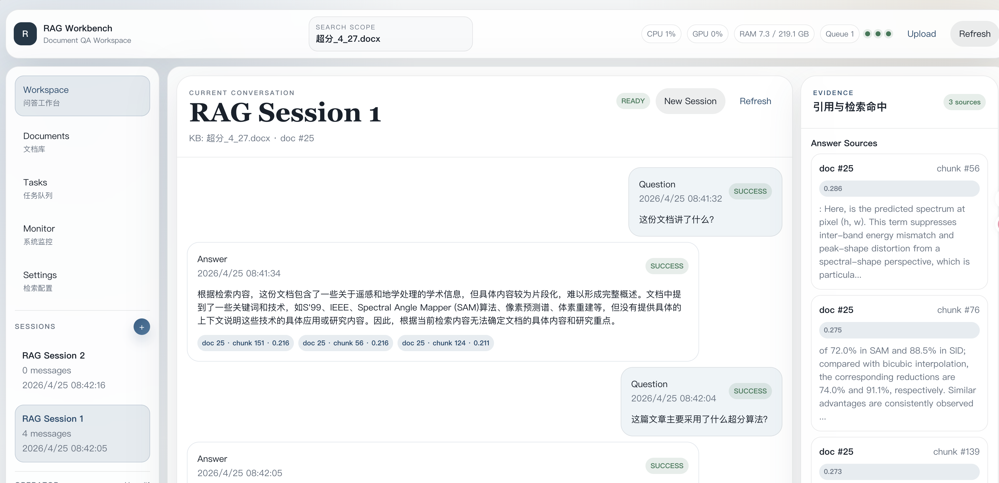
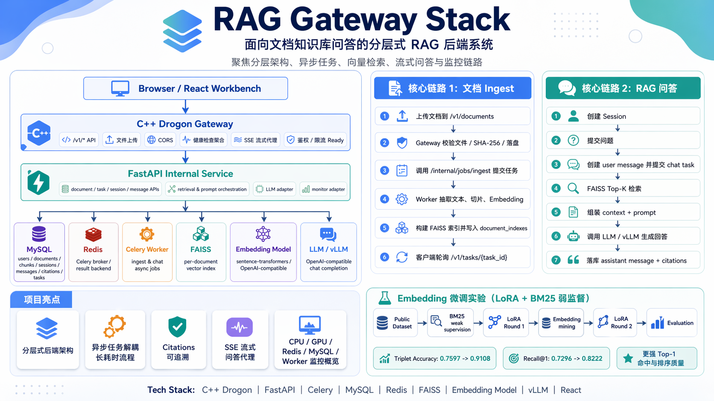

# RAG Gateway Stack

面向全局文档知识库问答的工程化 RAG 后端项目。它不是单页问答 demo，而是一套把外部 API 网关、内部业务服务、异步任务、数据库、向量索引、LLM 调用和监控工作台拆开的可扩展系统骨架。

项目当前由 `C++ Drogon Gateway`、`FastAPI Internal Service`、`Celery Worker`、`MySQL`、`Redis`、`LanceDB`、`Embedding Model`、`OpenAI-compatible LLM / vLLM` 和 `React Workbench` 组成。前端主要用于调试、演示和观测，核心能力集中在后端 RAG 链路。



## 项目定位

这个项目适合用来验证和展示一套真实 RAG 应用后端应该具备的基础能力：

- 文档上传、去重、解析、切片、向量化、索引构建和全局归档。
- 基于全局 indexed 文档库的 LanceDB 向量召回、MySQL 批量取 chunk 正文、CrossEncoder rerank、Prompt 组装和 LLM 回答。
- 会话、消息、任务状态、引用来源和索引元数据的持久化。
- C++ 网关统一承载外部 API、上传控制、CORS、健康检查聚合和 SSE 代理。
- Celery 异步化处理 ingest 和 chat，避免长耗时流程阻塞请求。
- React 工作台展示文档、任务、问答、引用和系统监控。

## 项目亮点

| 能力 | 说明 |
| --- | --- |
| 分层架构 | 浏览器只访问 C++ Gateway，内部业务逻辑收敛在 FastAPI 服务中，便于后续接入鉴权、限流和审计。 |
| 全局知识库 | 文档上传仍记录归属用户，但索引完成后进入全局 indexed 文档库；任意用户的会话默认都能检索这些文档。 |
| 异步任务 | 文档解析和 embedding/index 构建拆成 Celery 任务执行，任务进度可查询。 |
| 可追溯回答 | 每条 assistant 消息都会保存 citations，前端可展示引用片段、chunk、score 和来源文档。 |
| Agent MVP | 只读 Agent 工具覆盖 `knowledge_search`、文档查询和 citation 查询，支持工具调用 Trace、Agent SSE 事件、用户/会话记忆和 citations 落库展示。 |
| 模型切换保护 | `document_indexes.embedding_model` 记录索引所用 embedding 模型，避免模型切换后误用旧向量空间。 |
| 监控视图 | 提供 CPU、内存、磁盘、GPU、MySQL、Redis、Worker、队列和 RAG 数据概览。 |
| 实验留档 | 包含 embedding LoRA 微调、RAG ingest/retrieval 容量和性能验证文档，方便继续迭代。 |

## 架构概览



```text
Browser / React Workbench
        |
        v
C++ Drogon Gateway
        |-- public API
        |-- upload validation
        |-- CORS
        |-- health aggregation
        |-- SSE proxy
        |
        v
FastAPI Internal Service
        |-- document / task / session / message APIs
        |-- retrieval and prompt orchestration
        |-- LLM and monitor adapters
        |
        +--> MySQL        : users, documents, chunks, indexes, sessions, messages, citations, tasks
        +--> Redis        : Celery broker / result backend
        +--> Celery       : ingest and chat async jobs
        +--> LanceDB    : metadata-only local vector index
        +--> Embedding    : sentence-transformers or OpenAI-compatible provider
        +--> LLM / vLLM   : OpenAI-compatible chat completion endpoint
```

## 技术栈

| 层级 | 技术 |
| --- | --- |
| 外部网关 | C++17, Drogon, CURL, JsonCpp |
| 内部服务 | Python, FastAPI, Pydantic |
| 异步任务 | Celery, Redis |
| 数据存储 | MySQL |
| 检索排序 | LanceDB vector recall, MySQL chunk hydration, sentence-transformers, CrossEncoder reranker |
| 大模型调用 | OpenAI-compatible API, vLLM |
| 前端工作台 | Vite, React, TypeScript |
| 运维脚本 | Bash, curl, benchmark scripts |

## 核心链路

### 文档 Ingest

1. 客户端上传文档到 `POST /v1/documents`，请求中仍携带 `user_id` 用于归档和审计。
2. C++ Gateway 校验文件类型、计算 SHA-256、保存文件，并写入文档记录。
3. Gateway 调用 FastAPI 内部接口提交 ingest 任务。
4. Celery `parse_document_task` 抽取文本并写入 `doc_chunks`，chunk 的 `embedding_status` 初始为 `pending`。随后 `build_embedding_task` 生成 embedding 并写入 LanceDB。
5. Worker 将 LanceDB 行标记为 indexed 后，更新 `doc_chunks.vector_index_status=indexed` 和 `documents.index_status=indexed`；MySQL 仍是 documents/chunks/citations/tasks 的 source of truth。
6. 客户端通过 `GET /v1/tasks/{task_id}` 查看处理进度。

解析器支持 `.md`、`.txt`、`.json`、`.csv`、`.pdf`、`.docx` 和 `.xlsx`。其中 CSV、JSON records、DOCX 表格和 XLSX 工作表会尽量转换为 Markdown 表格再进入切片和 embedding，以保留列名、行关系和 sheet/table 来源。

### RAG 问答

1. 客户端创建 session 并提交用户问题；新流程不要求会话绑定某个 `doc_id`。
2. Gateway 创建 user message，再提交 chat task。
3. Worker 默认在全局 `documents.index_status=indexed` 文档范围内执行 LanceDB 向量召回，LanceDB 只返回 `chunk_id` 等检索元数据；服务再从 MySQL 批量读取 chunk 正文并交给 CrossEncoder rerank。兼容旧调用：如果请求显式传 `doc_id` 或 `doc_ids`，则只检索指定文档范围。
4. 系统组装上下文和 Prompt，调用 OpenAI-compatible LLM。
5. assistant message 与 citations 落库。
6. 前端刷新消息列表，展示回答和引用来源。

## 目录结构

```text
Repo/
├── cpp_gateway/          # Drogon C++ 对外网关
├── python_rag/           # FastAPI + Celery + RAG / Agent 业务实现
├── db/                   # MySQL 初始化脚本与增量升级脚本
├── frontend/             # Vite + React + TypeScript 前端工作台
├── scripts/              # 数据库、API、worker、vLLM、E2E 启动脚本
├── docs/                 # 设计、实验、容量和性能说明
├── data/                 # 上传文件与索引数据目录
├── .env.example          # 后端环境变量示例
└── README.md
```

`python_rag/app` 采用轻量分层目录，重构只调整目录和 import，不改变 API、RAG 检索策略、数据库表结构或 SSE 协议：

```text
python_rag/app/
├── main.py
├── api/v1/routers/       # FastAPI HTTP 路由，保留原有 /internal/* 路径
├── agent/                # Agent 决策、memory、tools、trace、streaming
│   ├── memory/           # 用户长期记忆、会话摘要、最近对话和异步更新任务
│   ├── streaming/        # Agent SSE 流式输出
│   ├── tools/
│   │   ├── base.py       # Tool 基类
│   │   ├── registry.py   # Tool 注册表
│   │   ├── local/        # 本地只读工具，如 knowledge_search、document/citation tools
│   │   └── mcp/          # MCP Tool 包装预留目录
│   └── trace/            # Agent run / step / tool call trace 服务
├── modules/              # chat、retrieval、documents、ingest、sessions、messages、tasks 等业务模块
├── workers/              # Celery app 与 worker task 实现
├── integrations/mcp/     # MCP client / 协议适配预留目录
├── infra/                # MySQL、Redis、Storage、schema support
├── core/                 # config、logger、errors、exception handlers、error codes
└── shared/               # 无业务状态的公共工具函数
```

关键边界：HTTP 路由只负责请求入口，业务逻辑放在 `app/modules`；Agent 编排和工具注册放在 `app/agent`；Celery 执行入口放在 `app/workers`；MySQL、Redis、Storage 等基础设施放在 `app/infra`。

## 快速开始

### 1. 初始化环境变量

```bash
cp .env.example .env
```

常用配置项包括 MySQL、Redis、Celery、存储目录、embedding、rerank 和 LLM 地址。默认 LLM 走远端 OpenAI-compatible API，不启动本地 vLLM：

```bash
LLM_RUNTIME=api
LLM_ENABLE=true
LLM_PROVIDER=openai_compatible
LLM_BASE_URL=https://open.bigmodel.cn/api/paas/v4
MIMO_API_KEY=your-api-key
LLM_MODEL=glm-4.7-flash

EMBEDDING_PROVIDER=sentence_transformers
EMBEDDING_MODEL=sentence-transformers/paraphrase-multilingual-MiniLM-L12-v2

RETRIEVAL_RERANK_TOP_K=5
RETRIEVAL_DENSE_TOP_K=50
RETRIEVAL_RECALL_PROVIDER=lancedb
VECTOR_STORE_PROVIDER=lancedb
LANCEDB_PATH=./data/lancedb
LANCEDB_TABLE=chunk_vectors
RRF_K=60
BM25_K1=1.5
BM25_B=0.75
CHAT_ENABLE_MOCK_FALLBACK=true
```

注意：C++ Gateway 启动时会从根目录 `.env` / 环境变量构造 Drogon 配置；MySQL、Redis、监听端口、安全和 SSE 代理参数都走统一的 `GatewayConfig` 入口。`cpp_gateway/config.json` 仅保留为手动调试参考。

### 2. 安装 Python 依赖

默认只需要 `rag-api` 环境运行 FastAPI、Celery Worker、embedding、rerank 和测试。只有明确选择本地 vLLM 时，才需要额外准备 `vllm-qwen3` 环境。详细安装、启动、代理和流式排障说明见 [运行环境与排障手册](docs/environment.md)。

```bash
conda create -n rag-api python=3.11
conda activate rag-api
pip install -r python_rag/requirements.txt
pip install -r python_rag/requirements-dev.txt

# 可选：仅在 LLM_RUNTIME=local_vllm 时需要
conda create -n vllm-qwen3 python=3.11
conda activate vllm-qwen3
pip install -r python_rag/requirements-vllm.txt
```

如果不用 conda，也可以继续使用仓库内 `.venv`，启动脚本会优先复用当前激活的环境。

### 3. 初始化数据库

```bash
bash scripts/init_db.sh
```

脚本会读取根目录 `.env`，创建 `MYSQL_DATABASE`，执行 `db/init.sql`，再按文件名字典序执行 `db/*_schema_upgrade.sql`。其中 `db/005_schema_upgrade.sql` 会为 `user_account` 补充用户长期记忆字段和已处理消息水位线。

如果业务用户不存在，或没有建库权限，可以在 `.env` 中补充：

```bash
MYSQL_ADMIN_USER=root
MYSQL_ADMIN_PASSWORD=your_root_password
```

### 4. 编译 C++ Gateway

需要本机已安装 `cmake`、C++17 编译器、Drogon、CURL、JsonCpp 以及 MySQL / Redis 相关 Drogon 依赖。

```bash
cmake -S cpp_gateway \
      -B cpp_gateway/build \
      -DCMAKE_BUILD_TYPE=Debug

cmake --build cpp_gateway/build -j
```

项目会优先使用 `CMAKE_TOOLCHAIN_FILE` / `VCPKG_ROOT`，也会从 `vcpkg` 命令、`$HOME/vcpkg`、`/opt/vcpkg`、`/usr/local/vcpkg` 自动发现 vcpkg toolchain。需要指定自定义 vcpkg 时，可额外传入：

```bash
-DCMAKE_TOOLCHAIN_FILE=/path/to/vcpkg/scripts/buildsystems/vcpkg.cmake
```

### 5. 启动服务

默认 LLM 通过远端 API 调用，不需要启动本地 vLLM。可以先执行一次 API 连通性检查：

```bash
bash scripts/start_vllm.sh
```

该脚本在 `LLM_RUNTIME=api` 时只检查 `${LLM_BASE_URL}/models`，不会启动本地模型。随后启动应用栈，包含 FastAPI、Celery Worker、C++ Gateway；可选启动前端。

```bash
# 后端应用栈
bash scripts/start_all.sh

# 后端应用栈 + 前端 Vite dev server
START_FRONTEND=true bash scripts/start_all.sh

# 查看应用栈状态
bash scripts/start_all.sh status

# 停止应用栈
bash scripts/start_all.sh stop
```

常用开关：

```bash
# 启动应用栈前先初始化数据库
START_INIT_DB=true bash scripts/start_all.sh
```

如果 `cpp_gateway/build/cpp_gateway` 不存在，脚本会尝试用 CMake 编译 Gateway；本机仍需要 Drogon、CURL、JsonCpp 以及 MySQL / Redis 相关 Drogon 依赖。使用 vcpkg 时脚本会自动发现并导出 `CMAKE_TOOLCHAIN_FILE`，也可以通过 `CMAKE_TOOLCHAIN_FILE` / `Drogon_DIR` 环境变量覆盖。

### 6. 手动启动后端链路

需要逐个服务排障时，可以每个服务单独开一个终端。

```bash
# 1. MySQL / Redis 先启动，并初始化数据库
bash scripts/init_db.sh

# 2. 启动 vLLM，默认使用 vllm-qwen3
bash scripts/start_vllm.sh

# 3. 启动 FastAPI，默认使用 rag-api
bash scripts/start_api.sh

# 4. 启动 Celery Worker，默认使用 rag-api
bash scripts/start_worker.sh
# Celery app 入口：python_rag.app.workers.celery_app

# 5. 启动 C++ Gateway
bash cpp_gateway/scripts/start_gateway.sh
```

健康检查：

```bash
curl http://127.0.0.1:8000/internal/health
curl http://127.0.0.1:8000/internal/monitor/overview
curl http://127.0.0.1:8080/health
curl http://127.0.0.1:8080/v1/monitor/overview
```

### 7. 启动前端工作台

```bash
cd frontend
npm install
npm run dev
```

Vite 默认把 `/health` 和 `/v1` 代理到 `http://127.0.0.1:8080`。如需修改代理目标，可以创建 `frontend/.env`：

```bash
VITE_PROXY_TARGET=http://127.0.0.1:8080
```

构建前端：

```bash
cd frontend
npm run build
```

## E2E 验证

完整链路一键验证：

```bash
bash scripts/e2e_all.sh ./day7_demo.md
```

该脚本会创建用户、上传文档、等待 ingest、创建会话、在不传 `doc_id` 的情况下提交 chat、拉取消息，并触发一次带 relevance label 的检索评估，用来验证全局知识库检索以及 Recall@K / MRR / NDCG 指标链路。

先创建用户：

```bash
curl -X POST http://127.0.0.1:8080/v1/users \
  -H "Content-Type: application/json" \
  -d '{"name":"demo-user"}'
```

上传与索引：

```bash
bash scripts/e2e_ingest.sh ./day7_demo.md
```

完整问答：

```bash
bash scripts/e2e_chat.sh ./day7_demo.md
```

默认检索链路为 `RETRIEVAL_RECALL_PROVIDER=lancedb`：LanceDB 先召回候选 `chunk_id`，默认 `RETRIEVAL_DENSE_TOP_K=50`，随后 MySQL 批量取 chunk 正文，再进入 CrossEncoder rerank。

CrossEncoder rerank 支持缓存优先加载：`RERANK_LOCAL_FILES_ONLY=true` 时会先从 Hugging Face cache 查找 `RERANK_MODEL`；如果缓存缺失且 `RERANK_DOWNLOAD_IF_MISSING=true`，会先下载 snapshot 到 `RERANK_CACHE_DIR` 或默认 HF cache，再从本地 snapshot 加载。

如果切换 embedding 模型，历史文档需要重新执行 parse/embedding/index 流程，否则 LanceDB 中旧向量空间可能不一致。

## Agent MVP 演示

第一版 RAG Agent 已固化为 MVP 演示路径：

```text
上传文档 -> ingest 建库 -> Agent 问答 -> 用户/会话记忆注入
-> 只读工具调用 -> Trace 展示 -> citations 展示
```

前端演示：

```bash
START_INIT_DB=true START_FRONTEND=true bash scripts/start_all.sh
```

打开 `http://127.0.0.1:5173`，上传文档并等待 `index_status=indexed`，在 Workspace 使用流式 Agent 问答。右侧 `Agent Trace` 会展示决策、工具调用和工具结果；回答完成后消息 citations 会在引用面板展示。

当前 Agent 记忆分为三层：`user_account.memory_summary` 保存跨 session 的用户长期记忆，`sessions.summary` 保存当前 session 中期摘要，最近 8 条 user/assistant 消息作为短期记忆直接进入 prompt。记忆更新由 Celery 异步触发，`python_rag.tasks.session_summary_update` 维护 session summary，`python_rag.tasks.user_memory_update` 维护用户长期记忆；两者都使用 message id 水位线避免重复处理和旧任务覆盖新结果。

默认只读工具包括：`knowledge_search` 检索 indexed 知识库，`get_document_detail` 查询文档元数据，`list_ready_documents` 列出可检索文档，`list_message_citations` 根据 assistant `message_id` 查询已保存 citations。

CLI 对照：

```bash
# 旧 RAG 基线路径
bash scripts/e2e_all.sh ./day7_demo.md

# 新 Agent 流式路径，需要已有 session_id 和 READY 文档
curl -N -X POST http://127.0.0.1:8080/v1/agent/chat/stream \
  -H "Content-Type: application/json" \
  -d '{"session_id":1,"message":"根据知识库总结这个系统的架构和核心链路","trace_id":"demo-agent-001"}'
```

更多验收步骤见 [Agent MVP 说明](docs/agent_mvp.md)、[Agent API 文档](docs/api_agent.md) 和 [MVP 演示案例](docs/demo_cases.md)。

## 前端页面

| 页面 | 说明 |
| --- | --- |
| `Workspace` | 核心问答工作区，包含会话、消息、上传、RAG 开关和引用面板。 |
| `Documents` | 文档上传、索引状态、chunk/向量化摘要和文档详情。 |
| `Tasks` | ingest/chat 任务表、进度、meta_json 和错误日志。 |
| `Monitor` | CPU、GPU、内存、MySQL、Redis、Worker、队列、RAG、ingest、LanceDB 和检索质量摘要。 |
| `Settings` | 网关地址、用户、top_k、chunk 参数和模型显示名。 |

## API 概览

前端和外部客户端优先通过 C++ Gateway 访问：

| Method | Path | 说明 |
| --- | --- | --- |
| `GET` | `/health` | 网关聚合健康检查。 |
| `POST` | `/v1/users` | 创建用户。 |
| `GET` | `/v1/users/latest` | 最近用户列表。 |
| `POST` | `/v1/documents` | 上传文档并提交 ingest 任务。 |
| `GET` | `/v1/documents` | 查询全局文档归档和索引状态，可选 `user_id`、`status`、`limit`。 |
| `GET` | `/v1/documents/{doc_id}` | 查询文档详情。 |
| `POST` | `/v1/sessions` | 创建会话。 |
| `POST` | `/v1/sessions/{session_id}/messages` | 创建用户消息并提交 chat 任务；默认检索全局 indexed 文档，兼容可选 `doc_id` / `doc_ids` 限定范围。 |
| `GET` | `/v1/sessions/{session_id}/messages` | 获取消息和 citations。 |
| `GET` | `/v1/tasks` | 查询任务列表。 |
| `GET` | `/v1/tasks/{task_id}` | 查询单个任务状态。 |
| `POST` | `/v1/chat/stream` | SSE 流式回答代理。 |
| `POST` | `/v1/agent/chat/stream` | Agent SSE 流式回答代理，包含 `agent_step`、`tool_call`、`tool_result`、`final` 和 `done` 事件。 |
| `GET` | `/v1/monitor/overview` | 系统与 RAG 监控概览。 |

FastAPI 内部接口以 `/internal/*` 为前缀，不建议浏览器直接访问。Agent Trace 调试入口包括 `GET /internal/agent/runs/{run_id}` 和 `GET /internal/agent/runs/{run_id}/steps`。

## 延伸文档

- [Agent MVP 说明](docs/agent_mvp.md)：固化第一版 RAG Agent 的演示范围、启动方式、验收流程和旧 RAG / 新 Agent 路径。
- [Agent API 文档](docs/api_agent.md)：整理文档上传、会话、旧 RAG、Agent 流式问答、Trace 和 citations 接口。
- [MVP 演示案例](docs/demo_cases.md)：提供前端和 CLI 演示脚本、预期结果和故障检查点。
- [运行环境与排障手册](docs/environment.md)：说明 `rag-api` 与 `vllm-qwen3` 两个 Python 环境的边界、启动方式、代理影响、SSE 流式链路和常见排障。
- [Embedding 微调实验](docs/embedding_finetune.md)：记录 KALM embedding 的 LoRA triplet 微调流程、指标和结论。
- [RAG ingest/retrieval 容量说明](docs/rag_ingest_retrieval_capacity.md)：整理 ingest、检索和资源容量相关设计。
- [性能测试指南](docs/performance_test_guide.md)：提供部署后的性能验证、压测流程和留档模板。
- [Gateway 鉴权与限流](docs/gateway_auth_rate_limit.md)：说明 Drogon Gateway 的 API Key 鉴权和 Redis 限流配置。
- [监控指标说明](docs/monitoring_metrics.md)：说明解析耗时、FAISS 耗时、TTFT、Celery 并发和检索质量指标。
- [代码审核与完成度评估](docs/code_review_completion_assessment.md)：记录当前 Gateway / `python_rag` 审核结果、完成度和后续路线图。

## 后续方向

- 提供 Docker Compose，一键启动 MySQL、Redis、FastAPI、Celery Worker 和 C++ Gateway。
- 扩展自动化测试覆盖更多失败路径、鉴权限流边界、API contract 和检索评估数据集。
- Gateway 增加 request id 透传、审计日志、统一错误响应和更清晰的上游异常映射。
- 完善 LanceDB 索引维护：索引状态回查、重建指定文档索引、孤儿向量清理、备份恢复和容量监控。
- 为扫描件 PDF 接入 OCR 解析链路。
- 将 embedding LoRA 接入方式标准化，支持合并模型路径或 adapter 加载。

## 推荐验证命令

```bash
pip install -r python_rag/requirements-dev.txt
cd python_rag
python3 -m compileall app
cd ..
python3 -m pytest tests
bash scripts/ci_smoke.sh
```

`scripts/ci_smoke.sh` 会执行 Python 编译、pytest、shell 语法检查；如果本机安装了 `npm`，还会执行前端构建。当前机器如果没有 Drogon 开发包，需要先安装 Drogon 或设置 `Drogon_DIR` / `CMAKE_PREFIX_PATH` 后再编译 `cpp_gateway`。
