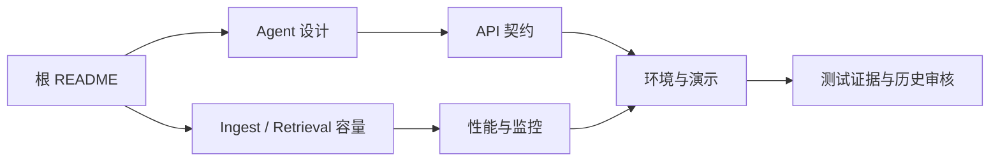

# 从哪里开始读：RAG Gateway Stack 文档地图

`docs/` 不是根 README 的重复版本。根 README 负责讲清整个系统为什么这样设计；这里把架构、接口、运行、验证和历史证据拆成可以独立阅读的技术文章。

## 按问题选择文档

| 你现在想解决的问题 | 建议阅读 |
| --- | --- |
| 想先理解整个项目 | [根 README：架构与完整执行链](../README.md) |
| 想理解 Agent 为什么不是普通 RAG 的替代品 | [从 RAG 基线到可观测 Agent](agent_mvp.md) |
| 想调接口或实现客户端 | [在 JSON 与 SSE 之间：Agent API 契约](api_agent.md) |
| 想把项目在本机跑起来 | [让本地 RAG 栈稳定运行：环境与排障](environment.md) |
| 想做一次可信的现场演示 | [如何演示一条不造假的 RAG / Agent 链路](demo_cases.md) |
| 想理解 ingest、检索和容量边界 | [从一个文件到百万 chunk](rag_ingest_retrieval_capacity.md) |
| 想设计性能实验 | [不要只测 QPS：性能测试指南](performance_test_guide.md) |
| 想看运行指标从哪里来 | [从系统健康到检索质量：监控指标](monitoring_metrics.md) |
| 想理解 Gateway 的安全边界 | [把流量挡在业务之前：鉴权与限流](gateway_auth_rate_limit.md) |
| 想复盘 embedding 微调实验 | [当 Top-1 上升而 Recall@10 下降](embedding_finetune.md) |
| 想查看历史测试证据 | [Agent MVP 联调证据](agent_mvp_test_report.md) |
| 想查看历史代码审核 | [从 Demo 到工程系统：代码审核快照](code_review_completion_assessment.md) |

## 推荐阅读路径

如果只准备本地运行，直接阅读“环境与排障”和“演示案例”即可。如果要修改检索或 Agent 逻辑，建议先读根 README、容量设计和 Agent 设计，再进入 API 文档。

## 如何理解文档中的结论

这里区分三种内容：

- **当前契约**：接口、启动命令、数据结构和运行约束，应与当前代码一致。
- **设计讨论**：解释为什么选择 MySQL、LanceDB、Celery、SSE 或只读工具，以及它们的取舍。
- **历史快照**：测试报告和代码审核只证明当时执行过什么，不代表当前进程仍处于同样状态。

文档不会把默认配置描述成实际运行配置，也不会把“接口存在”描述成“服务健康”。涉及性能、容量和质量的数字都需要结合对应实验条件阅读。

## 文档维护约定

- 外部调用优先写 Gateway `/v1/*`；FastAPI `/internal/*` 只用于服务间调用和调试。
- FastAPI 和多数 Gateway JSON API 使用 `{code, message, data}`；Gateway 安全错误的旧 envelope 是当前已知例外。SSE 使用有 `type` 的编号事件，并以 `done` 或 `error` 结束。
- 启动命令以 `scripts/start_all.sh` 为统一入口；本地 vLLM 保持独立启动。
- 新增真实验证结果时记录日期、命令、环境边界和未执行项。
- 架构变化先更新根 README，再更新这里对应的专题文章。
