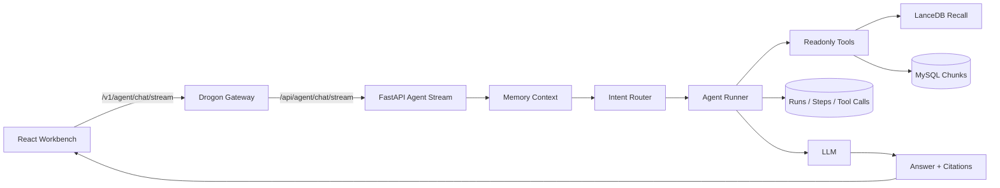

# 从 RAG 基线到可观测 Agent：MVP 的边界与闭环

[返回文档地图](README.md)

把 Agent 接到 RAG 上并不难，难的是回答三个问题：它什么时候应该检索，工具失败后如何收敛，最后的答案能否追溯到一次真实运行。这个 MVP 不追求工具数量，而是先让一条最小闭环稳定成立：

```text
上传文件或网页 URL -> ingest 建库 -> Agent 问答 -> 只读工具循环调用
-> Trace 展示 -> citations 展示
```

这篇文章讨论这条闭环为什么这样划分、普通 RAG 为什么仍然保留，以及怎样用前端和 Trace 证明 Agent 确实执行过预期步骤。

## 先定义边界，再讨论能力

### 已纳入

- 文件上传、网页 URL 导入、解析、切片、embedding、LanceDB 向量索引构建。
- 普通 RAG 路径：直接检索全局 indexed 文档并生成回答。
- 新 Agent 路径：后端先做轻量检索意图路由，必要时强制首轮 `knowledge_search`；后续由 LLM 循环决策是否继续调用只读工具或输出最终答案。
- Agent Trace：记录 `agent_runs`、`agent_steps`、`agent_tool_calls`，前端流式展示执行轨迹。
- Citations：Agent 从 `knowledge_search` 结果生成 citations，并复用原有 `citations` 表和前端证据区域展示。
- 前端工作台：上传文档、查看任务、问答、Trace、引用来源和监控概览。

### 暂不纳入

- 多工具写操作、外部联网工具、代码执行工具。
- 长程自主规划和跨请求任务执行。当前循环只在单次 Agent 请求内运行，并受 `max_steps` 安全上限保护。
- 多租户隔离和生产级鉴权审计。网关已有 API Key/限流基础能力，但 MVP 演示默认按本地环境使用。

## 一次 Agent 请求经过哪些边界



Celery 不参与 Agent 流式生成；它负责 ingest 和普通 RAG 的非流式任务。这个区别很重要：看到 Worker 没有 `chat_generate` 并不代表 Agent 流没有执行。

## 代码目录

Agent 代码收敛在 `python_rag/app/agent`：`orchestrator.py` 保留稳定调用入口，`agent_runner.py` 承担执行循环，`intent_router.py` 处理轻量检索意图，`tool_protocol.py` 统一工具结果，`tools/local` 放只读工具，`streaming` 负责可续传 SSE，`trace` 负责 run / step / tool call 持久化。普通 RAG 和检索能力位于 `python_rag/app/modules`，Celery 入口位于 `python_rag/app/workers`。

## 先把运行条件固定下来

### 1. 环境变量

复制并按本机环境调整 `.env`：

```bash
cp .env.example .env
```

MVP 默认使用远端 OpenAI-compatible LLM：

```bash
LLM_RUNTIME=api
LLM_ENABLE=true
LLM_PROVIDER=openai_compatible
LLM_BASE_URL=https://provider.example/v1
LLM_API_KEY=your-api-key
LLM_MODEL=your-model
```

如果本机没有 reranker 权重且不希望演示时下载模型，可以临时设置：

```bash
RERANK_DOWNLOAD_IF_MISSING=false
RERANK_FALLBACK_TO_FAISS=true
```

`RERANK_FALLBACK_TO_FAISS` 是保留的历史配置名；当前默认 LanceDB 召回路径下，它表示 reranker 不可用时按向量召回顺序回退。

修改 `.env` 后需要重启 FastAPI 和 Worker，运行中的进程不会自动加载新配置。

### 2. 初始化数据库

```bash
bash scripts/init_db.sh
```

该脚本会执行 `db/init.sql` 和增量脚本，其中 `db/004_create_agent_tables.sql` 会创建 Agent Trace 所需的三张表。

### 3. 启动应用栈

```bash
bash scripts/start_vllm.sh
START_INIT_DB=true START_FRONTEND=true bash scripts/start_all.sh start
```

默认地址：

- 前端：`http://127.0.0.1:5173`
- Gateway：`http://127.0.0.1:8080`
- FastAPI：`http://127.0.0.1:8000`

查看状态：

```bash
bash scripts/start_all.sh status
curl http://127.0.0.1:8080/health
curl http://127.0.0.1:8000/internal/health
```

停止服务：

```bash
bash scripts/start_all.sh stop
```

## 为什么还要保留普通 RAG

### 普通 RAG 是稳定基线

普通 RAG 的非流式路径由 Gateway 提交 Chat 任务，Worker 执行检索和回答；流式路径则由 FastAPI 直接生成：

```text
POST /v1/sessions/{session_id}/messages
POST /v1/chat/stream
```

特点：

- 默认检索全局 indexed 文档。
- 可选 `doc_id` / `doc_ids` 限定文档范围。
- citations 来自检索命中的 raw hits，并随 assistant message 落库。

### Agent 增加决策层，而不是替换检索层

新 Agent 演示优先使用网关流式入口：

```text
POST /v1/agent/chat/stream
```

内部调试入口：

```text
POST /internal/agent/chat
POST /internal/agent/chat/stream
GET  /internal/agent/runs/{run_id}
GET  /internal/agent/runs/{run_id}/steps
```

特点：

- Agent 入口会先做轻量检索意图路由；命中项目文档、代码、架构、能力、上传文档、网页导入、embedding、索引等意图时，会先执行一次 `knowledge_search`，再让 LLM 基于工具结果总结。
- 未命中强制检索路由时，Agent 每轮由 LLM 判断是否需要继续调用工具。
- 当前只暴露只读工具：`knowledge_search`、`get_document_detail`、`list_ready_documents`、`list_message_citations`。
- 如果 LLM 返回 `tool_calls`，后端先按工具 schema 做轻量参数校验，再用工具自身 `timeout_ms` 执行工具并把结果写回上下文；如果 LLM 不再返回 `tool_calls`，该轮内容作为最终答案。
- 强制检索会在 Trace 中记录为 `forced_tool_call` step；后续 LLM 仍可继续调用其他只读工具。
- 工具结果统一为 `{"ok": bool, "error": string | null, "data": object}`。`ok=true` 时 Agent 只使用 `data` 作为证据；`ok=false` 或 `error` 非空时会记录失败并基于已有信息降级回答。
- `max_steps` 是防止异常循环的安全上限；达到上限时不会直接失败，而是进入一次无工具最终回答阶段，说明已达到工具调用上限并基于已有观察给出当前结论。重复的同名同参数工具调用会被跳过并记录到 Trace。
- 工具调用、工具结果、最终回答会写入 Trace。Run 级 Trace 还会记录 `AGENT_VERSION`、`PROMPT_VERSION` 和 `prompt_tokens` / `completion_tokens` / `total_tokens` 汇总。
- `knowledge_search` 命中的 chunk 会转换成 citations，保存到原有 `citations` 表。

## 在工作台里观察真实执行

1. 打开 `http://127.0.0.1:5173`。
2. 在 Settings 创建或选择用户，然后回到 Sessions 创建会话。
3. 从左侧文档轨道上传 `day7_demo.md`，或导入一个可直接访问的网页 URL。
4. 等待文档依次经过 Parsing、Chunking、Embedding，最终进入 Indexed；失败时直接查看任务错误。
5. 保持 `Agent + RAG` 开启，提问：`根据知识库总结这个系统的架构和核心链路`。
6. 观察中央 Execution Flow：`knowledge_search`、LanceDB、MySQL hydration、CrossEncoder 与保存 citations 只会依据真实事件推进。
7. 观察右侧 Agent Trace：事件应按 `agent_step -> tool_call -> tool_result -> delta -> final -> done` 延伸，并保留 `run_id`、`step_id` 和 `event_id`。
8. 回答完成后检查引用编号和来源 chunk；没有检索证据时 citations 为空是正确结果。

## CLI 验收

普通 RAG 一键链路：

```bash
bash scripts/e2e_all.sh ./day7_demo.md
```

Agent 流式链路可以在完成上传、建库、创建 session 后调用：

```bash
curl -N -X POST http://127.0.0.1:8080/v1/agent/chat/stream \
  -H "Content-Type: application/json" \
  -d '{"session_id":1,"message":"根据知识库总结这个系统的架构和核心链路","trace_id":"demo-agent-001"}'
```

拿到 `done.meta.run_id` 后查询持久化 Trace：

```bash
curl http://127.0.0.1:8000/internal/agent/runs/1
curl http://127.0.0.1:8000/internal/agent/runs/1/steps
```

查询消息和 citations：

```bash
curl http://127.0.0.1:8080/v1/sessions/1/messages
```

## 最小回归测试

```bash
python3 -m pytest \
  tests/test_agent_orchestrator.py \
  tests/test_agent_trace_service.py \
  tests/test_agent_api.py \
  tests/test_agent_streaming_service.py \
  tests/test_knowledge_search_tool.py \
  tests/test_get_document_detail_tool.py \
  tests/test_list_ready_documents_tool.py \
  tests/test_citation_tools.py
```

更完整的本地检查：

```bash
python3 -m compileall python_rag tests
python3 -m pytest tests
```

## MVP 完成不等于生产完成

这条链路已经足以证明 Agent 能检索、能失败、能降级、能留下 Trace，也能把 citations 持久化。但它仍然是单请求内的受限循环，不包含写工具、跨请求自主任务、多租户隔离和生产级审计。保留这些边界，比在演示中暗示“通用 Agent 平台”更重要。
