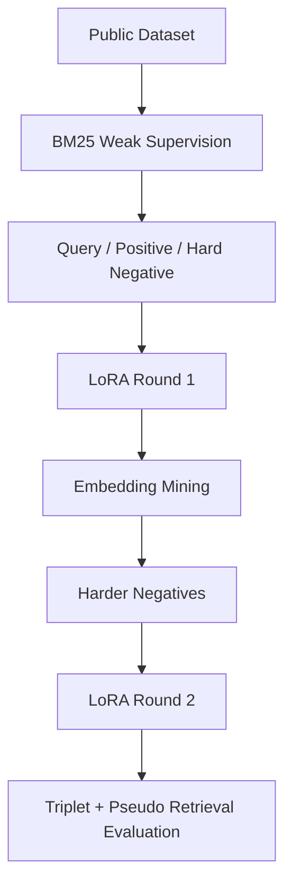

# 当 Top-1 上升而 Recall@10 下降：一次 Embedding LoRA 实验复盘

[返回文档地图](README.md)

Embedding 微调最危险的结论是“指标涨了，所以检索一定更好”。这次 KALM LoRA triplet 实验得到了一组更值得讨论的结果：Top-1、MRR 和 NDCG 上升，但 Recall@5 / Recall@10 下降。它说明模型更会把正确结果排到前面，同时也可能牺牲宽召回。

本文记录数据构造、两轮 hard-negative 自举、指标解释和接入当前 RAG 系统时必须遵守的索引兼容约束。所有数字只对应这次实验数据，不代表当前默认 Qwen embedding 的线上表现。

## 先明确实验想修复什么

通用 embedding 模型在领域文档中可能出现以下问题：

- query 与目标 chunk 的语义距离不够稳定。
- hard negative 与 positive 的分数区分度不足。
- Top-1 命中率不够理想，影响 RAG 首屏答案质量。

本实验不是只做一次静态 triplet 训练，而是采用“BM25 弱监督 + embedding 自举挖掘”的两阶段流程。目标是先用公开数据集快速构造可训练样本，再用第一轮模型反过来挖掘更难、更贴近模型错误分布的数据对，扩大 positive 与 negative 的 margin，并提升伪检索排序指标。

## 两轮自举如何产生更难的负样本



具体思路：

1. 下载公开检索或问答数据集，整理为 query、document/chunk、相关性标签或可弱标注字段。
2. 使用 BM25 先做弱监督召回：高相关候选作为 positive，同 query 下排名靠前但不匹配标注的候选作为 hard negative。
3. 将 query、positive、negative 组织为 triplet 数据，进行第一轮 LoRA 微调。
4. 使用第一轮微调后的 embedding 模型重新编码 query 和 corpus，通过向量检索挖掘新的候选。
5. 根据检索结果重建数据对：保留更稳定的 positive，补充模型容易混淆的 hard negative。
6. 用重构后的 triplet 数据进行第二轮训练，最终评估 triplet margin 和伪检索指标。

这个流程的核心是自举：BM25 提供低成本初始监督，第一轮模型暴露自身排序错误，第二轮训练重点学习这些更有价值的困难样本。

## 实验材料与可复现边界

| 项 | 值 |
| --- | --- |
| Base model | KALM embedding，本地实验制品未纳入仓库 |
| LoRA output | 本地 LoRA 输出目录，未纳入仓库 |
| Triplet samples | 1727 |

原实验依赖本机模型与输出目录，因此仓库当前只能复核指标记录，不能单凭本文重跑训练。要形成完整可复现实验，还需要补数据版本、随机种子、训练参数、依赖锁定和模型 artifact 校验值。

当前项目通过 `SentenceTransformer(EMBEDDING_MODEL)` 加载 embedding 模型。如果要使用 LoRA 结果，应先将 adapter 合并或导出为可直接加载的模型目录；另一种方式是显式扩展 embedding service，让它同时加载 base model 和 adapter。

## Triplet 指标：正负间隔确实扩大了

| 指标 | Base | LoRA | LoRA - Base |
| --- | ---: | ---: | ---: |
| Num Triplets | 1727 | 1727 | 0 |
| Triplet Accuracy | 0.759699 | 0.910828 | +0.151129 |
| Mean Margin | 0.113591 | 0.245272 | +0.131681 |
| Std Margin | 0.161327 | 0.185804 | +0.024477 |
| Mean Positive Score | 0.756601 | 0.525304 | -0.231297 |
| Mean Negative Score | 0.643010 | 0.280032 | -0.362978 |

解释：

- `Triplet Accuracy` 从 `0.759699` 提升到 `0.910828`，说明 LoRA 后模型更稳定地让 positive 分数高于 negative。
- `Mean Margin` 从 `0.113591` 提升到 `0.245272`，说明正负样本间隔扩大。
- LoRA 后 positive 和 negative 的绝对 score 都下降，但 negative 下降更多，因此 margin 提升。embedding 评估更关注相对排序和 margin，不应只看绝对相似度。

## 伪检索指标：头部更强，宽召回更弱

| 指标 | Base | LoRA | LoRA - Base |
| --- | ---: | ---: | ---: |
| Recall@1 | 0.729589 | 0.822235 | +0.092646 |
| MRR@1 | 0.729589 | 0.822235 | +0.092646 |
| NDCG@1 | 0.729589 | 0.822235 | +0.092646 |
| Recall@5 | 0.972206 | 0.940938 | -0.031268 |
| MRR@5 | 0.843872 | 0.873982 | +0.030110 |
| NDCG@5 | 0.877075 | 0.891069 | +0.013994 |
| Recall@10 | 0.982050 | 0.956572 | -0.025478 |
| MRR@10 | 0.845246 | 0.876023 | +0.030777 |
| NDCG@10 | 0.880315 | 0.896082 | +0.015767 |

解释：

- Top-1 相关指标提升 `+0.092646`，对 RAG 问答很有价值，因为排第一的 chunk 往往对答案影响最大。
- `MRR@5`、`MRR@10` 和 `NDCG@5`、`NDCG@10` 都提升，说明排序质量整体变好。
- `Recall@5` 和 `Recall@10` 下降，说明 LoRA 模型更强调头部排序，但宽召回有一定损失。后续需要用真实业务 QA 集继续验证，并考虑调大 `top_k`、混合召回或 rerank。

## 接入系统前，先处理向量空间兼容

### 配置模型

如果 LoRA 已合并或导出为可直接加载的 SentenceTransformer 模型：

```bash
EMBEDDING_PROVIDER=sentence_transformers
EMBEDDING_MODEL=/path/to/exported/kalm_lora_sentence_transformer
EMBEDDING_DEVICE=auto
EMBEDDING_NORMALIZE=true
```

如果使用 OpenAI-compatible embedding 服务托管模型：

```bash
EMBEDDING_PROVIDER=openai_compatible
EMBEDDING_BASE_URL=http://127.0.0.1:9000/v1
EMBEDDING_MODEL=kalm-lora-embedding
EMBEDDING_API_KEY=
EMBEDDING_NORMALIZE=true
```

### 重建索引

切换 embedding 模型后，必须重新 ingest 文档：

```bash
bash scripts/e2e_ingest.sh ./day7_demo.md
```

原因是旧向量索引使用的是旧向量空间。项目会把模型名写入 `document_indexes.embedding_model`，查询时如果发现当前模型和索引模型不一致，会返回冲突错误，提醒重新 ingest。

## 这次实验真正值得讨论的结论

- 为什么微调 embedding：提升领域 query 与 chunk 的匹配能力。
- 为什么看 triplet margin：RAG 检索更依赖相对排序，而不是单个分数的绝对值。
- 为什么保存 embedding model：防止旧索引和新模型混用。
- 为什么 Recall@5/10 下降也不能直接判定失败：Top-1、MRR、NDCG 提升说明头部排序更强，但宽召回需要结合业务数据继续评估。
- 如何接入工程：导出可加载模型、更新环境变量、重新 ingest、校验 `document_indexes.embedding_model`。

还需要保留一个负面结论：这不是完整业务 QA 评估。伪检索样本与训练构造存在相关性，Top-1 提升可能部分来自数据分布。下一步应在独立人工标注集上比较默认 Qwen embedding、KALM base、LoRA 和 rerank 组合，而不是只继续优化同一套 triplet。
