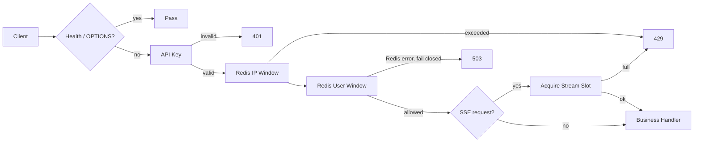

# 把流量挡在业务之前：Drogon Gateway 的鉴权、限流与 SSE 保护

[返回文档地图](README.md)

Gateway 的安全职责不是判断“这个问题能不能回答”，而是在请求进入 Python 业务逻辑之前解决三个更基础的问题：调用者是谁，请求频率是否可接受，长连接是否会耗尽进程资源。

## 请求进入业务前经历什么



保护范围：

- `/health` 不做鉴权和限流，供负载均衡与运维探活。
- `OPTIONS` 不拦截，CORS 允许 `Authorization`、`X-API-Key`、`X-User-Id` 和 Last-Event-ID。
- `/v1/*` 先鉴权，再执行 IP / User 限流。
- `/v1/chat/stream` 与 `/v1/agent/chat/stream` 还要申请 SSE stream slot。

## API Key 不是用户系统，但可以形成稳定 principal

客户端支持两种 header：

```http
X-API-Key: your-secret-key
Authorization: Bearer your-secret-key
```

配置：

```bash
GATEWAY_AUTH_ENABLED=true
GATEWAY_API_KEYS=admin=dev-secret,worker=worker-secret
GATEWAY_API_KEY_HEADER=X-API-Key
```

`GATEWAY_API_KEYS` 支持 `name=secret`、`name:secret` 或纯 secret。名称会成为限流 principal；纯 secret 只生成本地指纹，原始 key 不进入 Redis key。

这套能力适合服务级或本地环境访问控制，不等于完整用户身份体系。生产环境仍需要密钥轮换、审计和租户授权。

鉴权与限流错误使用统一的非 SSE 响应 envelope：

```json
{
  "code": "UNAUTHORIZED",
  "message": "missing API key",
  "data": null
}
```

## 为什么同时做 IP 和 User 两层限流

只有 IP 限流时，同一 NAT 下的用户会互相影响；只有 User 限流时，匿名请求又可能绕开约束。因此网关按顺序执行：

1. 连接 IP 固定窗口。
2. `X-User-Id`；没有时使用 API Key principal。
3. 两者都没有时只保留 IP 限流。

Redis Lua 脚本在一次操作中完成 `INCR`、首次 `EXPIRE` 和 `TTL` 查询，避免计数成功但过期时间丢失。

```bash
GATEWAY_RATE_LIMIT_ENABLED=true
GATEWAY_RATE_LIMIT_WINDOW_SECONDS=60
GATEWAY_RATE_LIMIT_IP_LIMIT=120
GATEWAY_RATE_LIMIT_USER_LIMIT=60
GATEWAY_RATE_LIMIT_FAIL_OPEN=false
GATEWAY_RATE_LIMIT_REDIS_PREFIX=rag_gateway:rate_limit
GATEWAY_TRUST_X_FORWARDED_FOR=false
```

关键取舍：

- `FAIL_OPEN=false` 时 Redis 故障返回 `503 RATE_LIMIT_UNAVAILABLE`；安全优先，但会牺牲可用性。
- `FAIL_OPEN=true` 时继续放行并写 warning；可用性优先，但失去速率保护。
- 只有明确位于可信反向代理之后，才设置 `TRUST_X_FORWARDED_FOR=true`，否则客户端可以伪造来源 IP。
- 命中限制返回 `429`、`Retry-After` 和 `X-RateLimit-*` headers。

## SSE 保护的是线程和连接，而不只是请求数

当前 Gateway 每个活跃流使用一个受控的 stream slot，但底层仍是 detached OS thread 和阻塞 libcurl。因此 SSE 的主要资源不是瞬时 QPS，而是连接持续时间。

```bash
GATEWAY_MAX_STREAMS=64
GATEWAY_SSE_CONNECT_TIMEOUT_SECONDS=10
GATEWAY_SSE_UPSTREAM_IDLE_TIMEOUT_SECONDS=120
GATEWAY_SSE_UPSTREAM_LOW_SPEED_BYTES=1
GATEWAY_SSE_CURL_BUFFER_BYTES=1024
GATEWAY_SSE_EMIT_GATEWAY_METRICS=true
```

- Chat 和 Agent 流共享同一个并发上限。
- 上游结束、失败或下游断开后释放 slot。
- upstream idle timeout 防止无数据连接永久占用线程。
- `gateway_metrics` 在首个上游字节前发送，用于 Gateway 视角 TTFT；它是 transport metadata，不带 Agent event ID。
- Last-Event-ID 由 Gateway 透传给 Python，续传状态由后端流注册表管理。

## 最小验证

在本地测试配置中启用较低阈值：

```bash
GATEWAY_AUTH_ENABLED=true
GATEWAY_API_KEYS=admin=dev-secret
GATEWAY_RATE_LIMIT_WINDOW_SECONDS=60
GATEWAY_RATE_LIMIT_IP_LIMIT=3
GATEWAY_RATE_LIMIT_USER_LIMIT=2
```

重启 Gateway：

```bash
bash scripts/start_all.sh restart gateway
```

缺少 key：

```bash
curl -i http://127.0.0.1:8080/v1/monitor/overview
```

携带 key 和用户身份：

```bash
curl -i http://127.0.0.1:8080/v1/monitor/overview \
  -H "X-API-Key: dev-secret" \
  -H "X-User-Id: demo-user"
```

重复请求超过 User 阈值后应返回 `429`。验证完成后恢复真实配置，不要把演示 key 提交到仓库。

## 这层保护没有解决什么

- API Key 不是多租户授权模型。
- 固定窗口不提供令牌桶那样平滑的突发控制。
- stream slot 限制不能消除“一流一线程”的扩展上限。
- 当前没有 request ID 全链路审计，也没有 Gateway handler 自动化测试覆盖所有安全分支。

这些边界应该进入容量和上线评审，而不是因为本地 `curl` 返回 200 就被忽略。
